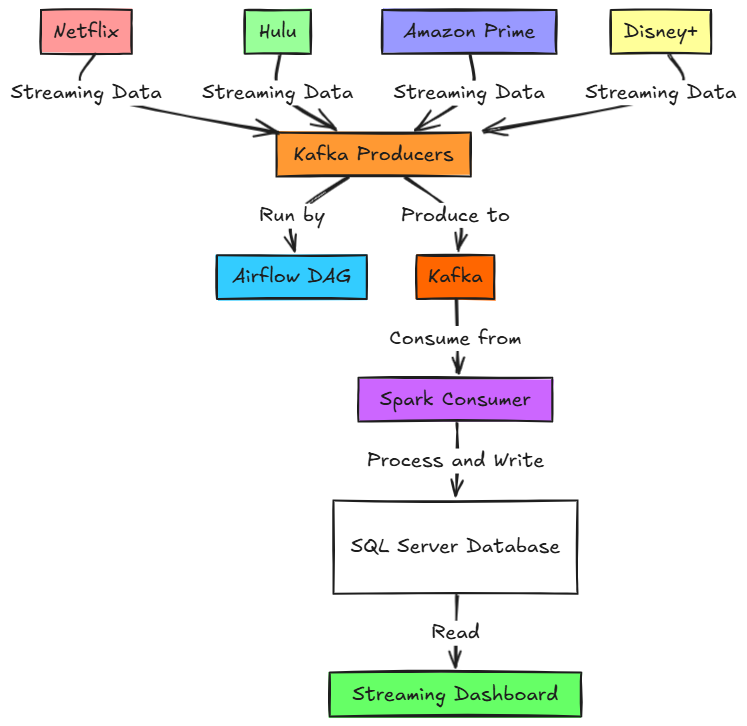

# Movie Platforms Data Streaming Project

This project extracts data from various streaming platforms (Netflix, Hulu, Amazon Prime, Disney+) and sends it to Kafka for processing using Apache Spark. The data producers are managed and run in parallel using Apache Airflow. The processed data is then streamed into a database table and visualized on a real-time streaming dashboard.

## 📑 Table of Contents

- [Overview](#overview)
- [Architecture](#architecture)
- [Features](#features)
- [Technologies Used](#technologies-used)

## 📝 Overview

The Movie Platforms Data Streaming Project aims to provide a real-time data pipeline that ingests, processes, and visualizes data from different streaming services. It leverages Kafka for data streaming, Apache Spark for data processing, and integrates with Apache Airflow, a database, and a streaming dashboard for parallel processing, analysis, and insights.

## 🏛️ Architecture

The project's architecture consists of the following components:

1. **Data Ingestion**: Data is collected from Netflix, Hulu, Amazon Prime, and Disney+.
2. **Apache Airflow**: Manages and orchestrates the producers in parallel for efficient data ingestion.
3. **Kafka**: Acts as a message broker for streaming data.
4. **Apache Spark**: Processes data in real time, performing transformations and aggregations.
5. **Database**: Stores the processed data for long-term analysis.
6. **Streaming Dashboard**: Visualizes the data in real time.

## ✨ Features

- Real-time data ingestion from multiple streaming platforms.
- Parallel data producer execution using Apache Airflow.
- Scalable data processing using Apache Spark.
- Data storage for long-term analysis and reporting.
- Real-time visualization via a streaming dashboard.

## 🛠️ Technologies Used

- **Apache Airflow**: For orchestrating and running data producers in parallel.
- **Kafka**: For data streaming and message brokering.
- **Apache Spark**: For real-time data processing.
- **Python**: For data extraction and processing scripts.
- **SQL Database**: For storing processed data.
- **Docker**: For containerizing the application components.
- **Dashboarding Tool**: Real-time visualization using PowerBI.

